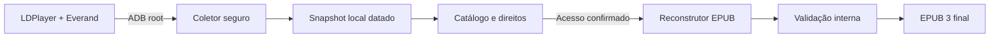

# Arquitetura

## Visão geral

O aplicativo separa aquisição, catálogo, conversão e interface para que cada etapa possa ser validada isoladamente.

## Componentes

### `everand_app/adb_client.py`

- Localiza o ADB do LDPlayer em instalações comuns, registro e `PATH`.
- Lista e seleciona emuladores conectados.
- Confirma ADB root e a presença do pacote do Everand.
- Pausa o aplicativo somente quando ele está em execução.
- Cria arquivos TAR em uma pasta temporária própria no Android.
- Valida caminhos, rejeita links e extrai para um snapshot novo.
- Remove os temporários e reabre o Everand quando aplicável.

### `everand_app/catalog.py`

- Descobre diretórios numéricos de ebooks completos.
- Lê metadados bibliográficos dos bancos locais.
- Confirma tipo EPUB, acesso integral e permissão de download.
- Calcula tamanho e estado apresentado na interface.
- Coordena conversões em lote.

### `everand_to_epub.py`

- Obtém a chave local associada ao documento.
- Decifra recursos em memória usando `cryptography` no desenvolvimento ou CNG no build confiável.
- Reconstrói XHTML, CSS, imagens, fontes, navegação e metadados.
- Gera primeiro um arquivo temporário, valida-o e só então substitui a saída.

### `everand_app/ui.py`

- Interface PySide6 com tarefas executadas fora da thread visual.
- Busca, seleção, pasta de saída, progresso e mensagens de erro.
- Configurações persistidas por usuário com `QSettings`.

## Dados locais

Por padrão, o aplicativo usa:

- `%LOCALAPPDATA%\Everand EPUB Studio\snapshots`
- `%LOCALAPPDATA%\Everand EPUB Studio\logs`
- `%USERPROFILE%\Documents\EPUBs Everand`

Snapshots nunca são enviados ao repositório e não fazem parte da release.

## Controles de segurança

- Lista fixa de recursos privados coletados.
- Argumentos ADB fornecidos separadamente ao processo.
- Pasta remota temporária com identificador aleatório e prefixo controlado.
- Proteção contra caminhos absolutos, `..`, links simbólicos e hard links em TAR.
- Snapshots novos em vez de limpeza destrutiva da biblioteca anterior.
- Bancos SQLite abertos em modo somente leitura e imutável.
- Verificação de acesso anterior à leitura da chave e à conversão.
- Gravação atômica do EPUB final.
- Auditoria de assinatura Authenticode dos componentes nativos da edição `Trusted`.
